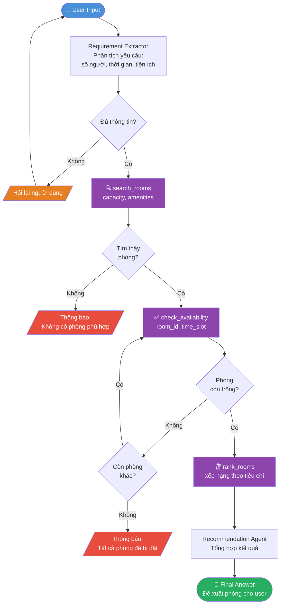

# Flowchart — Classroom Recommendation Agent

Dùng file này để render ra `flowchart.png`.

**Cách render:**
- Online: paste vào [mermaid.live](https://mermaid.live) → Export PNG
- VS Code: cài extension "Markdown Preview Mermaid Support" → preview → screenshot

---

